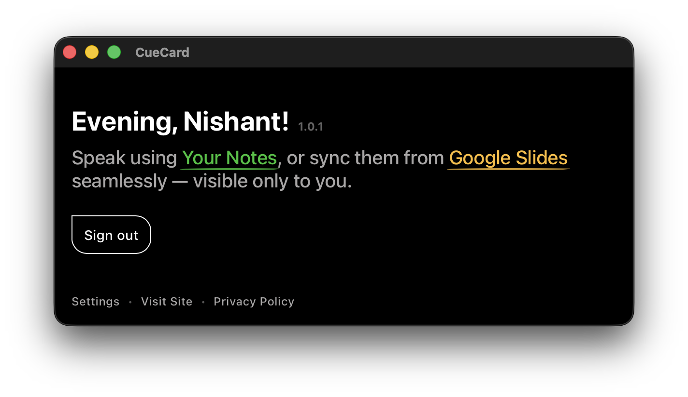
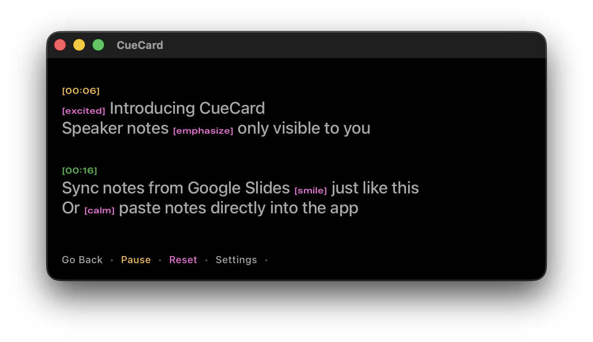

# CueCard

Speaker notes visible only to you — for presentations, meetings, dates and everything.

CueCard is a lightweight cross-platform desktop teleprompter (macOS & Windows) that keeps your speaker notes in view without letting anyone else see them. Whether you're giving a presentation, or leading a meeting, you can keep your talking points floating above everything else – invisible to screen shares and recordings.

<a href="https://www.youtube.com/watch?v=D2xCqQFtK-k"><strong>▶ Watch the Demo</strong></a>

## Why CueCard?
- **Always on top, always private.** CueCard opens a floating window that stays above all other applications yet is hidden from screen sharing tools. Your audience sees only your slides; you see your notes.
- **Works with Google Slides or your own text.** Use the companion browser extension to sync your existing Google Slides speaker notes, or just paste any text into the CueCard app.
- **Free and open‑source.** CueCard is released under the MIT license, and the code is available on GitHub. It’s completely free to use.

## Features

CueCard focuses on the essentials so you can focus on your delivery:

### On Time, Every Time

* Write notes naturally or add simple `[time]` tags to control pacing
* Use tags like `[time 00:15]` or `[time 03:00]` to schedule sections of your speech
* CueCard shows a subtle on-screen countdown for each time cue

### Full of Emotions

* CueCard helps you adjust tone and energy naturally—without memorizing every change
* Add `[emotion]` tags directly inside your notes to guide your delivery
* Use tags like `[emotion smile]`, `[emotion emphasize]`, `[emotion excited]`, or `[emotion hype]`
* Emotion cues appear as colored markers next to your text

### Ghost Mode for Your Notes

* Keep your notes completely hidden from viewers during screen sharing or recording
* Ghost Mode ensures only you can see the floating note card
* Toggle visibility instantly with a single click

### Just Enough to See

* Adjust the transparency of the note card using a simple slider
* Increase opacity for clear reading or fade it for subtle visibility
* Find the perfect balance between readability and discretion

## Get Started

### Install CueCard

- **Mac Desktop App**:
  - Download the latest DMG from the [GitHub Releases](https://github.com/thisisnsh/cuecard/releases) page
  - Drag `CueCard` into your `Applications` folder
  - Supports Intel and Apple Silicon (Universal binary)

- **Windows Desktop App**:
  - Download the latest installer from the [GitHub Releases](https://github.com/thisisnsh/cuecard/releases) page
  - Choose the installer for your system:
    - `CueCard_x64-setup.exe` for 64-bit Intel/AMD processors
    - `CueCard_x86-setup.exe` for 32-bit systems
    - `CueCard_arm64-setup.exe` for ARM64 devices (Surface, Snapdragon)

> The browser extension is **only required** for syncing Google Slides speaker notes.

- **Chrome Extension**: 
  - Install CueCard directly from the Chrome Web Store

- **Safari Extension**:
  - Download the latest DMG from the [GitHub Releases](https://github.com/thisisnsh/cuecard/releases) page
  - Drag `CueCard Extension` into your `Applications` folder
  - Open Safari and go to `Safari › Settings › Extensions` to enable the CueCard extension

### View Google Slides Notes

1. Open the **CueCard** app
2. Ensure the **CueCard browser extension** is installed and running
3. Click the **Google Slides** button in the app
4. Open your Google Slides deck to load the speaker notes
5. Start the slideshow in **Presenter View**, then close the default Google Slides notes window

> **Tip:** If notes don’t appear immediately, move to the next slide and then return to the previous one.

### View Other Notes

1. Open the **CueCard** app
2. Click **Paste Your Notes**
3. Paste your notes into the editor

> No browser extension is required for pasted notes.

## Repository Guide

- [`cuecard-app/README.md`](cuecard-app/README.md) – app details, Firebase configuration, build + release steps
- [`cuecard-extension/README.md`](cuecard-extension/README.md) – browser extension architecture, build scripts, store packaging
- [`cuecard-website/README.md`](cuecard-website/README.md) – static site powering cuecard.dev

## Links

- Privacy Policy: [https://cuecard.dev/privacy/](https://cuecard.dev/privacy/)
- Terms of Service: [https://cuecard.dev/terms/](https://cuecard.dev/terms/)
- Contributing guide: [CONTRIBUTING.md](CONTRIBUTING.md)
- MIT License: [LICENSE](LICENSE)

For help or support, contact **[support@cuecard.dev](mailto:support@cuecard.dev)**.
