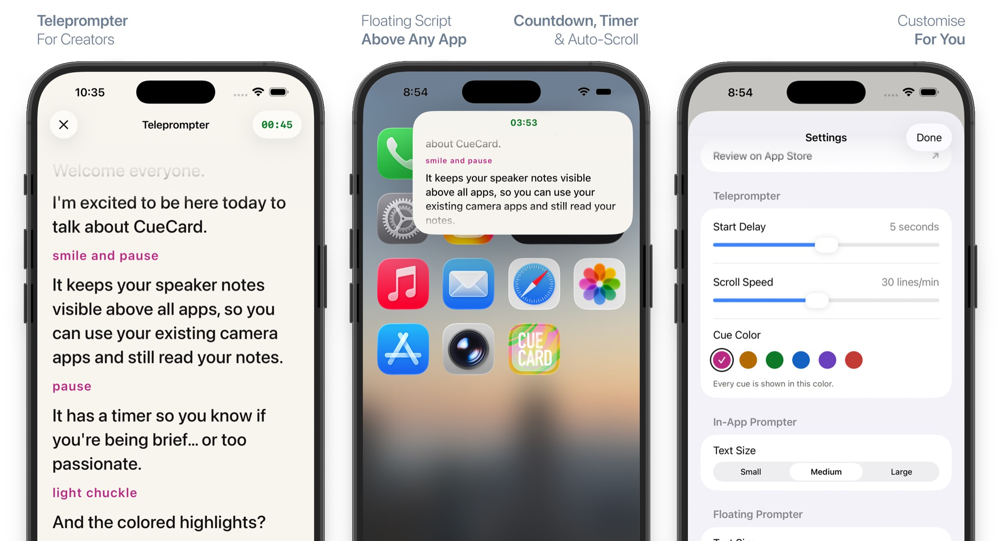

# CueCard

**A free teleprompter that stays on top.**

Read your script over the apps you film in on iPhone and iPad. On Mac and Windows, keep speaker notes visible to you and out of your screen share.

 

## 📖 About CueCard

CueCard is two apps that do the same job on different screens, both free, and open source.

**On iPhone and iPad**, it is a teleprompter that floats on top of every other app. Your script sits in a small window above the camera, Instagram, TikTok, a live stream or anything else, scrolling while you talk, so you never switch away from what you are recording in. The camera never sees it, because it is a window on your screen and not something in front of the lens.

**On Mac and Windows**, it is the opposite trick: the window is left out of screen capture by the operating system itself. On Zoom, Google Meet and Microsoft Teams the room sees your deck and never your notes, even though the window is right there on your screen.

**Made for:**
- 🎥 Reels, TikToks, Shorts and anything else filmed on a phone
- 🎙️ Live streams and podcasts
- 💼 Client presentations, sales demos and investor pitches
- 🏢 All-hands, webinars and town halls
- 🎓 Online classes, lectures and course recordings

 

## 📥 Download CueCard

### 📱 On your phone and iPad

*Your script floats on top of whatever app you record in.*

### 💻 On your computer

*Speaker notes that your screen share cannot see.*

### 🔌 Browser extension

*Only needed to send Google Slides speaker notes to the desktop app as you change slides.*

**Every download and its instructions live at [cuecard.dev](https://cuecard.dev/#download)**

 

## ✨ Why CueCard?

- **Free on every screen you speak from.** No subscription, no trial, no paid tier, nothing to cancel.
- **No account required.** There is nothing to sign up for. Open the app and start writing. Google sign-in is only needed for Google Slides sync on desktop.
- **Open source.** MIT licensed, and the code is right here. An app that can see your script is one worth being able to read the source of.
- **Your scripts stay on your device.** They are not uploaded to us. See the [privacy policy](https://cuecard.dev/privacy/) for the details.

 

## ⚡ On iPhone and iPad

### 📲 Floats on top of every other app

Your script stays on screen while you record in the camera app, Instagram, TikTok or anything else, so you never have to switch apps in the middle of a take to check your next line.

### ▶️ Scrolls on its own, at your pace

Set how fast the script moves in lines per minute and it scrolls by itself while you talk. Speed it up or slow it down at any time, and pause it whenever you need a moment. It follows a set speed, not your voice.

### 🎨 Cues you read but never say out loud

Type something like `[cue smile]` or `[cue slow down]` in the middle of your script and it appears in colour — pink, yellow, green, blue, purple or red, whichever you pick in Settings. It is a reminder about how to say the next line, not a line to read.

### ⏱️ A countdown to start, and a timer while you talk

CueCard counts you in before the script starts moving, so you have a few seconds to get ready. A timer then runs while you speak, so you know whether the take is running long.

### 🪟 A floating window you can shape and move

Drag the window anywhere on screen, make it wide, square or tall, and set the text size inside it. Put it just under the camera lens and your eyes stay close to the lens instead of drifting down.

### 💾 Scripts you save and come back to

Give a script a name, save it, and open it again next time. You can also import one from a file. The app follows your phone's light or dark appearance, or you can set it to stay light or stay dark.

> **One honest caveat:** the phone app is invisible to the *camera*, not to a screen recording. A screen recording or screen broadcast captures your whole screen, prompter included. Only the desktop app is genuinely excluded from screen capture.

 

## ⚡ On Mac and Windows

### 👻 Hidden from your screen share

The CueCard window is left out of screen capture by the operating system itself. On Zoom, Google Meet and Microsoft Teams, everyone sees your slides and never your notes — even though the window is right there on your screen. Ghost Mode is on by default and can be turned off in Settings when you want to show the notes on purpose.

### 🎨 Cues you read but never say out loud

Type something like `[cue slow down]` in your notes and it appears in colour. It reminds you how to say the next part instead of giving you another line to read. The older `[note ...]` spelling still works.

### ⏱️ A timer that counts your slot down

Set how long you have on the **Set Timer** pill and CueCard counts it down on screen while you talk. It is the easiest way to keep a thirty-minute slot to thirty minutes.

### 📊 Google Slides notes that follow your slides

Add the CueCard browser extension and the speaker notes for the slide you are on show up in CueCard as you move through the deck. You do not have to scroll to keep up.

### 📄 Works with any deck, or no deck at all

Google Slides is optional. Paste your notes straight into CueCard and present from PowerPoint, Keynote, a PDF, or nothing at all — it is a teleprompter on its own.

### ⌨️ Keyboard shortcuts for the whole thing

Show and hide the window, move it, resize it, fade it back over your slides with the transparency slider, and start or reset the timer from the keyboard, without ever clicking away from what you are presenting.

 

## 🚀 How to Use CueCard

### 📱 Filming on a phone or iPad

1. Open **CueCard** and tap **New Note**, or **Import from File**
2. Type or paste your script, dropping in `[cue ...]` tags wherever you want a reminder
3. Set your start delay, scroll speed and text size in **Settings**
4. Tap the green play button to read full screen, or **Start Overlay** for the floating window
5. Drag the floating window up under the lens, open your camera app, and record

### 💻 Presenting from a computer, with your own notes

1. Open the **CueCard** app
2. Click **Paste Your Notes**
3. Paste or type your notes into the editor
4. Your notes appear in the floating window, and your screen share does not see it

> **No browser extension is required for pasted notes.**

### 📊 Presenting from Google Slides

1. Open the **CueCard** app
2. Ensure the **CueCard browser extension** is installed and running
3. Click the **Google Slides** button in the app
4. Open your Google Slides deck to load the speaker notes
5. Start the slideshow in **Presenter View**, then close the default Google Slides notes window

> **Tip:** If notes don't appear immediately, move to the next slide and then return to the previous one.

 

## 🎬 Watch it

| Screen | Film |
|--------|------|
| iPhone | [The floating teleprompter on iPhone](https://youtube.com/shorts/zSSABBm7K1Q) |
| iPad | [CueCard Teleprompter on iPad](https://youtube.com/shorts/cHfZ-XLuz1E) |
| Mac and Windows | [Speaker notes only you can see](https://youtu.be/lNKghjFrdTE) |

 

## 👨‍💻 For Developers

To build CueCard from source, see the guide for each part:

| Component | Description | Documentation |
|-----------|-------------|---------------|
| **Mobile App** | Native SwiftUI app for iPhone and iPad, plus the Kotlin/Compose Android app in progress | [`cuecard-mobile/README.md`](cuecard-mobile/README.md) |
| **Desktop App** | Tauri-based desktop application for macOS & Windows | [`cuecard-desktop/README.md`](cuecard-desktop/README.md) |
| **Browser Extension** | Chrome, Firefox, and Safari extensions for Google Slides | [`cuecard-extension/README.md`](cuecard-extension/README.md) |
| **Website** | Eleventy static site at cuecard.dev | [`cuecard-website/README.md`](cuecard-website/README.md) |

 

## 💡 Feature Requests

CueCard is open source, but it is not open to code contributions, so pull requests are not accepted. Ideas are welcome, though.

- [Request a feature](https://github.com/thisisnsh/cuecard/issues/new?template=feature-request.yml)
- Look through [open requests](https://github.com/thisisnsh/cuecard/issues) first. A 👍 on one that already exists counts too.

 

## 💬 Support & Contact

**Need help?**
- [Frequently asked questions](https://cuecard.dev/faq/)
- Email: [hello@thisisnsh.com](mailto:hello@thisisnsh.com)
- Issues: [GitHub Issues](https://github.com/thisisnsh/cuecard/issues)

**Legal & Resources:**
- [Privacy Policy](https://cuecard.dev/privacy/)
- [Terms of Service](https://cuecard.dev/terms/)
- [MIT License](LICENSE)
