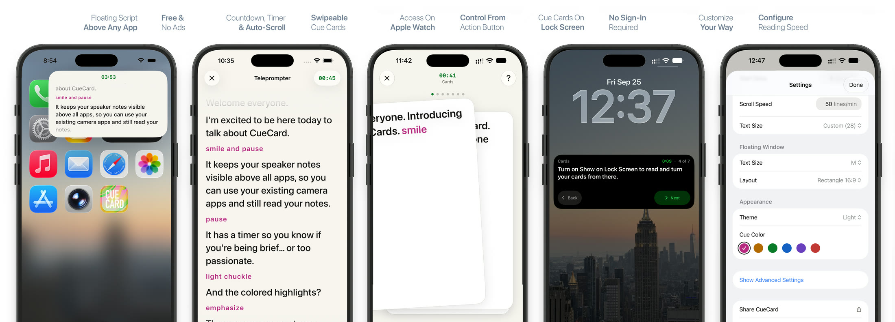

# CueCard

**A free teleprompter and cue card app that stays on top.**

On iPhone, iPad and Apple Watch, read a scrolling script over the apps you film in, or speak from cue cards on your Lock Screen and your wrist. On Mac and Windows, keep speaker notes visible to you and out of your screen share.

 

## 📖 About CueCard

CueCard is free and open source, with an app for your phone and an app for your computer.

**On iPhone and iPad**, it has two modes. **Teleprompter** scrolls a script in a small window that floats on top of every other app, so you can read over the camera, Instagram, TikTok or a live stream without switching away. **Cards** gives you one short card at a time to speak from, on your phone, your Lock Screen or your Apple Watch.

**On Mac and Windows**, the window is left out of screen capture by the operating system itself. On Zoom, Google Meet and Microsoft Teams the room sees your deck and never your notes, even though the window is right there on your screen.

**Made for:**
- 🎥 Reels, TikToks, Shorts and anything else filmed on a phone
- 🎙️ Live streams and podcasts
- 🎤 Speeches, toasts, sermons and class presentations
- 💼 Client presentations, sales demos and investor pitches
- 🏢 All-hands, webinars and town halls
- 🎓 Online classes, lectures and course recordings

 

## 📥 Download CueCard

### 📱 On your iPhone, iPad and Apple Watch

*A teleprompter that floats over the app you record in, and cue cards for speaking live.*

### 💻 On your computer

*Speaker notes that your screen share cannot see.*

### 🔌 Browser extension

*Only needed to send Google Slides speaker notes to the desktop app as you change slides.*

**Every download and its instructions live at [cuecard.dev](https://cuecard.dev/#download)**

 

## ✨ Why CueCard?

- **Free on every screen you speak from.** No subscription, no trial, no paid tier, no ads, nothing to cancel.
- **No account required.** There is nothing to sign up for. Open the app and start writing. Google sign-in is only needed for Google Slides sync on desktop.
- **Open source.** Licensed under the GPLv3, and the code is right here. An app that can see your script is one worth being able to read the source of.
- **Your scripts stay on your device.** They are not uploaded to us. See the [privacy policy](https://cuecard.dev/privacy/) for the details.

 

## ⚡ On iPhone and iPad

### 🎬 A teleprompter and cue cards in one app

Switch between **Teleprompter** and **Cards** from the top of the editor. Each mode keeps its own script and its own settings, so switching never mixes the two.

### 📲 Floats on top of every other app

In Teleprompter mode, your script stays on screen while you record in the camera app, Instagram, TikTok or anything else. Drag the floating window anywhere, pick a rectangular or square layout, and set its text size. Put it just under the camera lens and your eyes stay close to the lens instead of drifting down.

### ▶️ Scrolls on its own, at your pace

Set how fast the script moves in lines per minute and it scrolls by itself while you talk. Pause it or drag it back whenever you need a moment. It follows a set speed, not your voice. On an iPhone with an Action Button, you can play and pause from the button or Control Center.

### 🃏 Cards on your Lock Screen

In Cards mode, write one thought per card and swipe through them in the app. Turn on **Show on Lock Screen** and you can turn cards and watch the timer with your phone locked.

### ⌚ An Apple Watch app

Control the teleprompter from your wrist, and read your cards there in step with your iPhone. Keep a deck on the watch to read it without your iPhone at all.

### ⏱️ A countdown to start, and a timer that warns you

CueCard counts you in before the script starts moving. A timer then runs while you speak and changes colour near the end and when you run over, in colours you choose and can tell apart. Leave the duration unset and it counts up instead.

### 🎨 Cues you read but never say out loud

Type something like `[cue smile]` or `[cue slow down]` in the middle of your script and it appears in colour. It is a reminder about how to say the next line, not a line to read.

### 💾 Saved notes, search and version history

Save a script or deck by name and find it again by title or text. Every save keeps a version, so you can compare changes and restore an earlier draft. Import from a file or share the text, and optionally choose a notes folder in Files that keeps the latest copy of every saved note outside the app.

> **One honest caveat:** the phone app is invisible to the *camera*, not to a screen recording. A screen recording or screen broadcast captures your whole screen, prompter included. Only the desktop app is genuinely excluded from screen capture.

 

## ⚡ On Mac and Windows

### 👻 Hidden from your screen share

The CueCard window is left out of screen capture by the operating system itself. On Zoom, Google Meet, Microsoft Teams and anything else that shares a screen, everyone sees your slides and never your notes. **Invisible to Screen Sharing** is on by default; turn it off in Settings, or with the **Invisible** button in the toolbar, when you want to show the notes on purpose.

### ▶️ A script that scrolls while you speak

Press play to open the prompter, with a scroll speed, text size and start delay you choose. Pause, go back, restart or scroll by hand whenever you need.

### ⏱️ A timer for your slot

Set a duration on the **Set Timer** pill and CueCard counts it down, warns you near the end and shows when you run over. With no duration set, it counts up. Changing slides does not reset it.

### 🎨 Cues you read but never say out loud

Type something like `[cue slow down]` in your notes and it appears in colour, reminding you how to say the next part instead of giving you another line to read.

### 💾 Saved scripts for the next presentation

Name a script and open it again from the sidebar. Import and export text files with your cues included.

### 📊 Google Slides notes that follow your slides

Add the CueCard browser extension and the speaker notes for the slide you are on show up in CueCard as you move through the deck.

### 📄 Works with any deck, or no deck at all

Google Slides is optional. Paste your notes straight into CueCard and present from PowerPoint, Keynote, a PDF, or nothing at all.

### ⌨️ Keyboard shortcuts for the whole thing

Show and hide the window, play and pause, move it, fade it back over your slides and run the timer from the keyboard, without clicking away from what you are presenting.

 

## 🚀 How to Use CueCard

### 📱 Filming with the teleprompter on iPhone or iPad

1. Tap the mode name at the top left of the editor and pick **Teleprompter**
2. Type or paste your script, or use **Import** in the ••• menu. Type `[` or tap **Add Cue** for a reminder
3. Tap the gear to set **Scroll Speed**, **Text Size** and the floating window's layout
4. Tap the timer beside the play button to set a duration and a countdown
5. Tap the green play button, then the picture-in-picture button to float the script
6. Open your camera app, drag the window up under the lens, and record

### 🃏 Speaking from cue cards

1. Tap the mode name at the top left of the editor and pick **Cards**
2. Write one thought per card, tapping **Create New Card** for the next
3. Tap **Read Cards** and swipe or tap **Back** and **Next** to move through the deck
4. To read with your phone locked, turn on **Show on Lock Screen** in Cards Settings. With the watch app installed, the deck is on your wrist too

### 💻 Presenting from a computer, with your own notes

1. Open the **CueCard** app
2. Type or paste your notes into the editor
3. Press play to scroll them, or just read them in the editor
4. Share your screen as usual. The room does not see CueCard

> **No browser extension is required for pasted notes.**

### 📊 Presenting from Google Slides

1. Install the **CueCard** desktop app and the **CueCard browser extension**
2. In CueCard, choose **Google Slides** and click **Connect Google Slides**
3. Allow read-only access to your presentations with Google
4. Open your deck in the browser and present. The notes in CueCard follow the current slide

> **Tip:** If notes don't appear immediately, move to the next slide and then return to the previous one.

 

## 🎬 Watch it

| Screen | Film |
|--------|------|
| iPhone | [The floating teleprompter on iPhone](https://youtube.com/shorts/zSSABBm7K1Q) |
| iPad | [CueCard Teleprompter on iPad](https://youtube.com/shorts/cHfZ-XLuz1E) |
| Mac and Windows | [Speaker notes only you can see](https://youtu.be/lNKghjFrdTE) |

 

## 👨‍💻 Building from Source

To build CueCard yourself, see the guide for each part:

| Component | Description | Documentation |
|-----------|-------------|---------------|
| **Mobile App** | Native SwiftUI app for iPhone, iPad and Apple Watch, plus the Kotlin/Compose Android app in progress | [`cuecard-mobile/README.md`](cuecard-mobile/README.md) |
| **Desktop App** | Tauri-based desktop application for macOS & Windows | [`cuecard-desktop/README.md`](cuecard-desktop/README.md) |
| **Browser Extension** | Chrome, Firefox, and Safari extensions for Google Slides | [`cuecard-extension/README.md`](cuecard-extension/README.md) |
| **Website** | Eleventy static site at cuecard.dev | [`cuecard-website/README.md`](cuecard-website/README.md) |
| **Workers** | Cloudflare Workers for app notifications and the website's GitHub releases proxy | [`cuecard-workers/README.md`](cuecard-workers/README.md) |

 

## 🚫 Contributions

**CueCard does not accept contributions.** Pull requests are read and considered, then closed without being merged.

If a pull request has a fix or feature worth having, [@thisisnsh](https://github.com/thisisnsh) will make the change themselves, using the pull request as a reference.

You are free to fork the code under the terms of the [license](#-license). Bug reports and ideas are welcome as issues:

- [Report a bug](https://github.com/thisisnsh/cuecard/issues/new?template=bug-report.yml)
- [Request a feature](https://github.com/thisisnsh/cuecard/issues/new?template=feature-request.yml)
- Look through [open issues](https://github.com/thisisnsh/cuecard/issues) first. A 👍 on one that already exists counts too.

 

## 📜 License

CueCard is licensed under the **GNU General Public License v3.0**. You may use, study, change and share it, but any copy or modified version you distribute must also be released under the GPLv3, with its source code. See [`LICENSE`](LICENSE) for the full text.

 

## 💬 Support & Contact

**Need help?**
- [Frequently asked questions](https://cuecard.dev/faq/)
- Email: [support@cuecard.dev](mailto:support@cuecard.dev)
- Issues: [GitHub Issues](https://github.com/thisisnsh/cuecard/issues)

**Legal & Resources:**
- [Privacy Policy](https://cuecard.dev/privacy/)
- [Terms of Service](https://cuecard.dev/terms/)
- [GPLv3 License](LICENSE)
